## GitHub stats

## Stack

## Timeline

## Projects

## Recently pushed

## Connect

Patched together from public GitHub data · made with <a href="https://readme-glassfolio.in/">Patch your profile</a>

